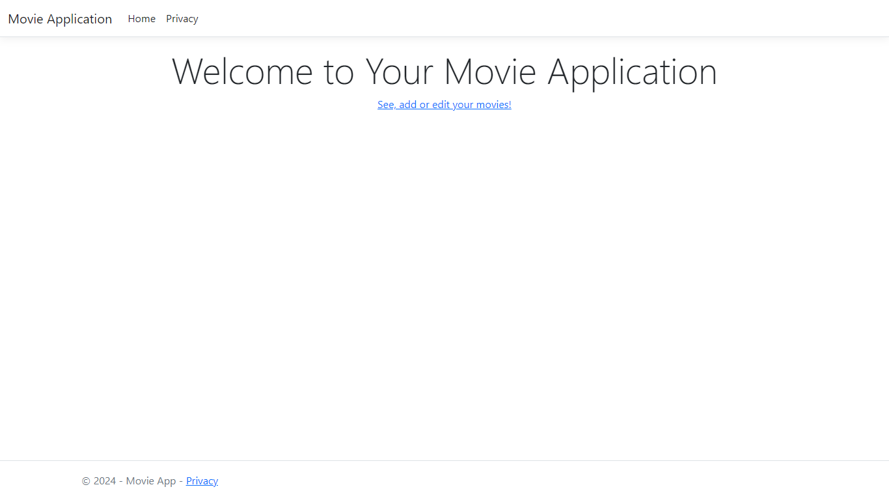
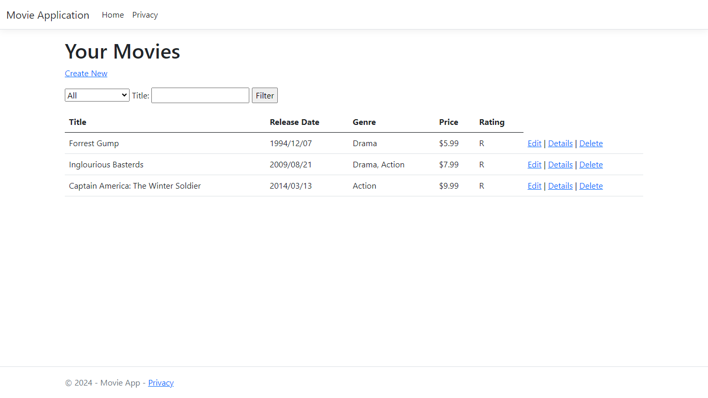
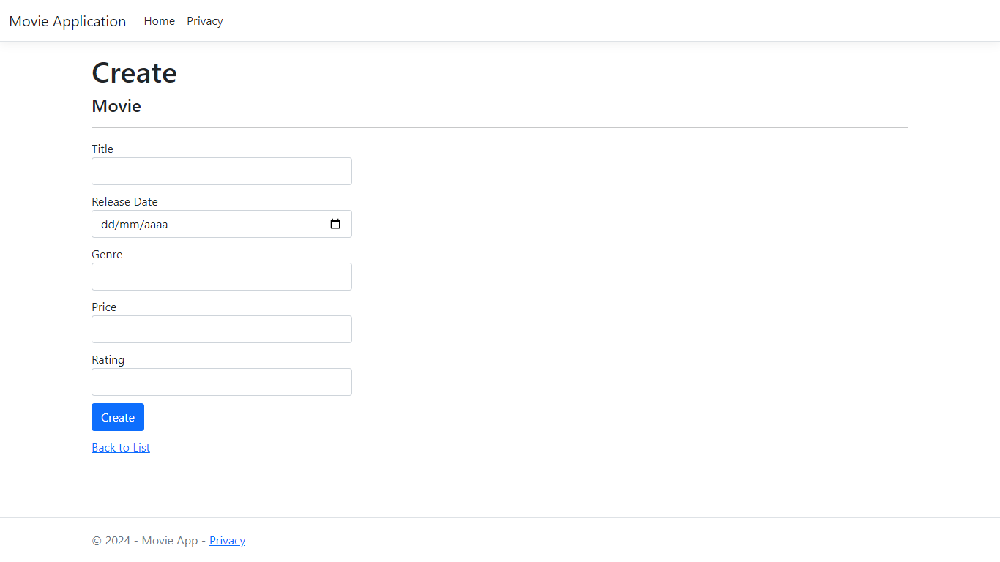
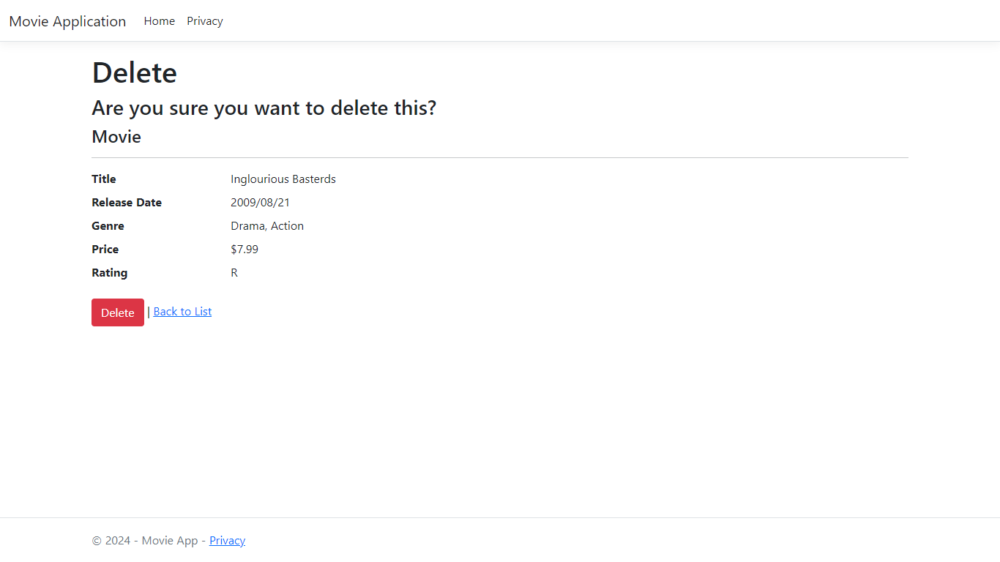
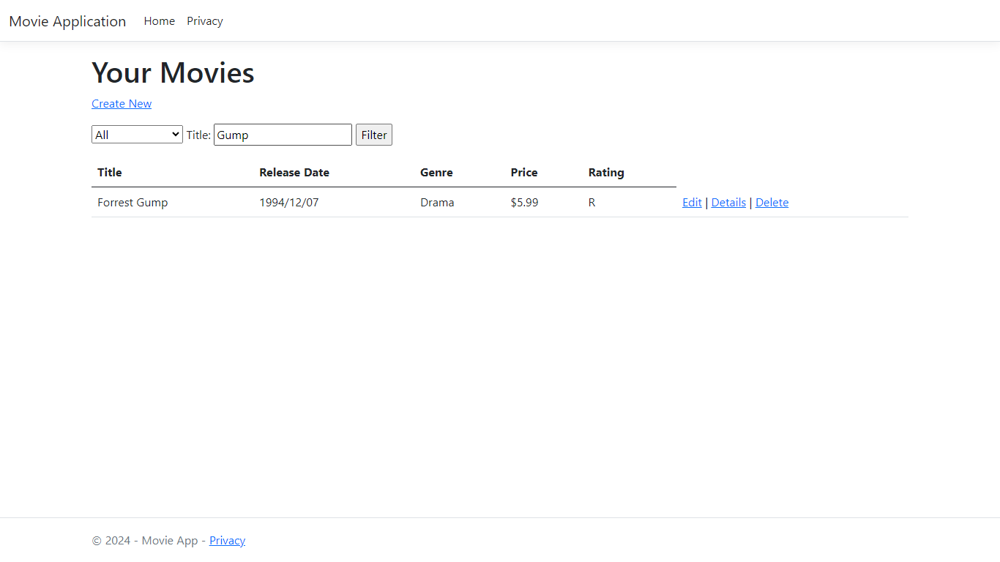

# Aplicação de FIlmes - ASP .NET MVC

## Descrição
Projeto MVC de gerenciamento de filmes com CRUD completo, onde o usuário pode cadastrar, listar, editar e excluir filmes. Além disso, também é possível buscar por filmes cadastrados.

### Objetivo
O objetivo do projeto é praticar e entender melhor o funcionamento do MVC no ambiente .NET. Também foi possível aprender sobre o processo de Engenharia Reversa (scaffolding) no .NET.

### Telas
: Home

: Movies List

: Create

: Delete

: Search

## Referências
[Introdução ao ASP.NET Core MVC](https://learn.microsoft.com/pt-br/aspnet/core/tutorials/first-mvc-app/start-mvc?view=aspnetcore-8.0&tabs=visual-studio)